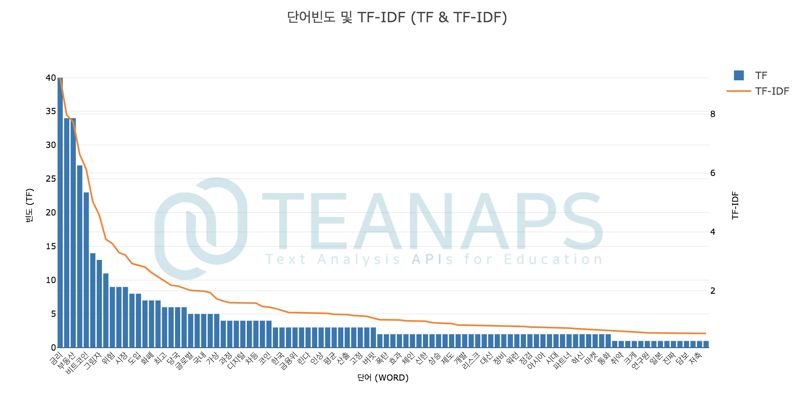
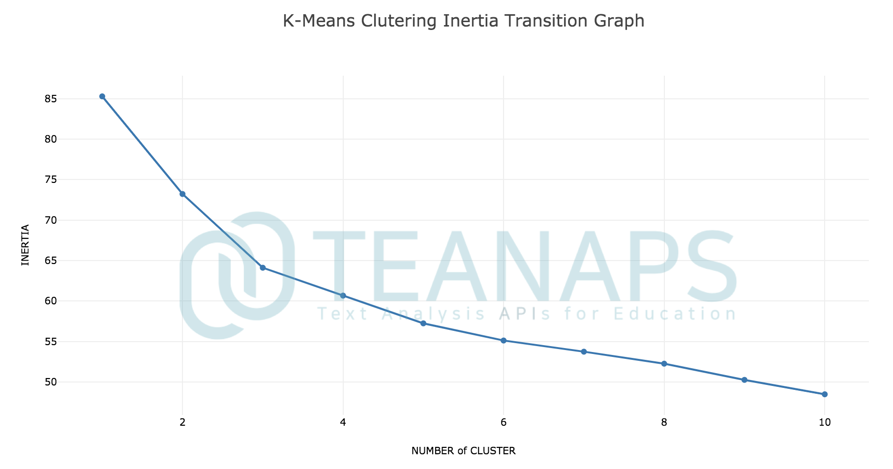
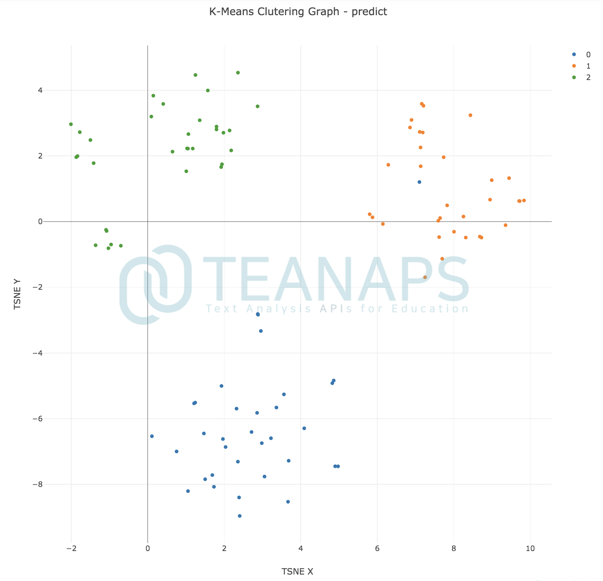
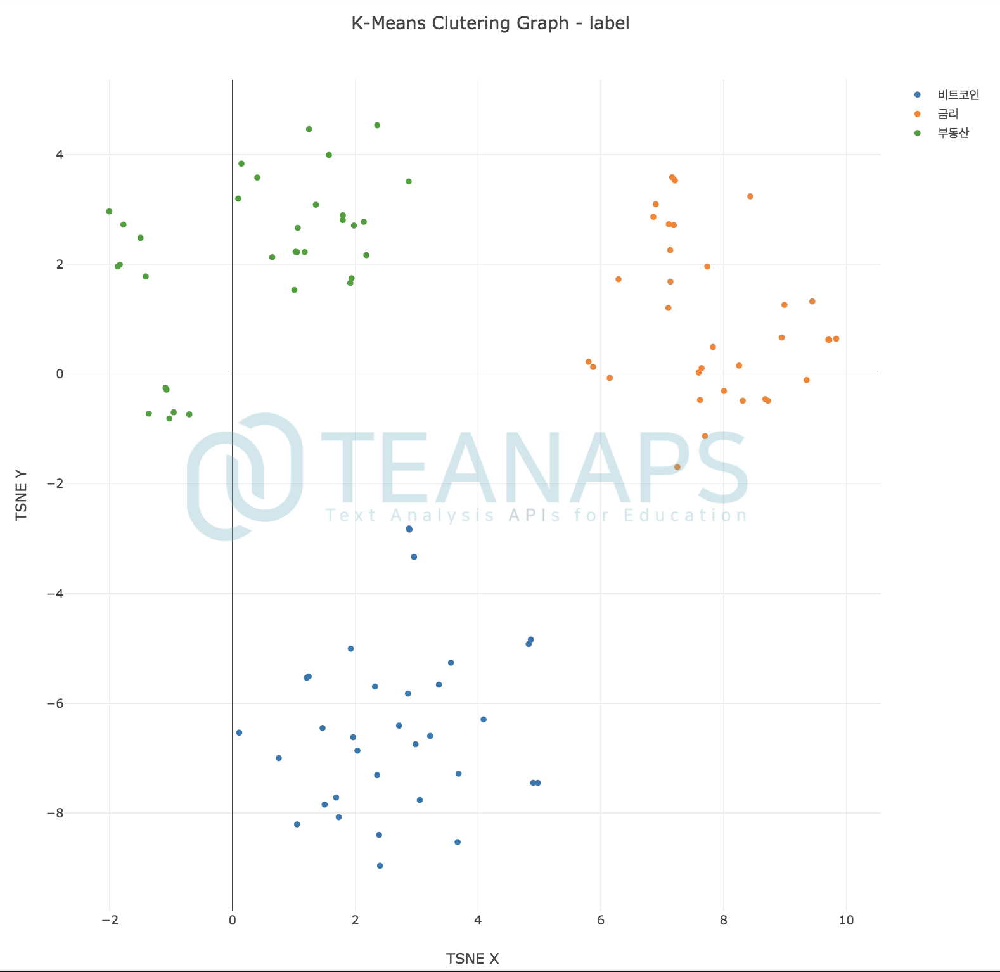

# `TEANAPS` User Guide

---
## Contents
- [Install `TEANAPS`](./teanaps_user_guide-install_teanaps.md#teanaps-user-guide)
- [API Documentation](./teanaps_user_guide-api_documentation-handler.md#teanaps-user-guide)
  - [Handler](./teanaps_user_guide-api_documentation-handler.md#teanaps-user-guide)
  - [NLP](./teanaps_user_guide-api_documentation-nlp.md#teanaps-user-guide)
  - Text Analysis
  - [Visualization](./teanaps_user_guide-api_documentation-visualization.md#teanaps-user-guide)
  - [Machine Learning](./teanaps_user_guide-api_documentation-machine-learning.md#teanaps-user-guide)
- [Tutorial](./teanaps_user_guide-tutorial.md#teanaps-user-guide)
- [References](./teanaps_user_guide-references_journal_project.md#teanaps-user-guide)
- [Journal & Project](./teanaps_user_guide-references_journal_project.md#teanaps-user-guide)
- [Appendix](./teanaps_user_guide-appendix.md#teanaps-user-guide)

---
## API Documentation

### `TEANAPS` Architecture

```python
├─teanaps  
│     │  
│     ├─ handler  
│     │     ├─ FileHandler  
│     │     ├─ MessageHandler  
│     │     └─ QueueHandler  
│     │  
│     ├─ nlp
│     │     ├─ MorphologicalAnalyzer
│     │     ├─ NamedEntityRecognizer
│     │     ├─ SyntaxAnalyzer 
│     │     ├─ Processing 
│     │     └─ Embedding 
│     │ 
│     ├─ text_analysis 
│     │     ├─ TfidfCalculator 
│     │     ├─ DocumentClustering
│     │     ├─ TopicClustering 
│     │     ├─ CoWordCalculator
│     │     ├─ SentimentAnalysis
│     │     ├─ DocumentSummarizer 
│     │     └─ KeyphraseExtraction
│     │  
│     ├─ visualization
│     │     ├─ GraphVisualizer
│     │     └─ TextVisualizer 
│     │  
│     └─ machine_learning
│           ├─ Regression
│           ├─ Classification
│           └─ Clustering
└─────────────────────────────────────────
```

### Jump to

| Package   | Class     |
|-----------|-----------|
| [handler](./teanaps_user_guide-api_documentation-handler.md#1-teanapshandler)    | [FileHandler](./teanaps_user_guide-api_documentation-handler.md#11-teanapshandlerfilehandler), [MessageHandler](./teanaps_user_guide-api_documentation-handler.md#12-teanapshandlermessagehandler), [QueueHandler](./teanaps_user_guide-api_documentation-handler.md#13-teanapshandlerqueuehandler)    |
| [nlp](./teanaps_user_guide-api_documentation-nlp.md#2-teanapsnlp)    | [MorphologicalAnalyzer](./teanaps_user_guide-api_documentation-nlp.md#21-teanapsnlpmorphologicalanalyzer), [NamedEntityRecognizer](./teanaps_user_guide-api_documentation-nlp.md#22-teanapsnlpnamedentityrecognizer), [SyntaxAnalyzer](./teanaps_user_guide-api_documentation-nlp.md#23-teanapsnlpsyntaxanalyzer), [Processing](./teanaps_user_guide-api_documentation-nlp.md#24-teanapsnlpprocessing), [Embedding](./teanaps_user_guide-api_documentation-nlp.md#25-teanapsnlpembedding)    |
| [text_analysis](./teanaps_user_guide-api_documentation-text_analysis.md#3-teanapstext_analysis)    | [TfidfCalculator](./teanaps_user_guide-api_documentation-text_analysis.md#31-teanapstext_analysistfidfcalculator), [DocumentClustering](./teanaps_user_guide-api_documentation-text_analysis.md#32-teanapstext_analysisdocumentclustering), [TopicClustering](./teanaps_user_guide-api_documentation-text_analysis.md#33-teanapstext_analysistopicclustering), [CoWordCalculator](./teanaps_user_guide-api_documentation-text_analysis.md#34-teanapstext_analysiscowordcalculator), [SentimentAnalysis](./teanaps_user_guide-api_documentation-text_analysis.md#35-teanapstext_analysissentimentanalysis), [DocumentSummarizer](./teanaps_user_guide-api_documentation-text_analysis.md#36-teanapstext_analysisdocumentsummarizer), [KeyphraseExtraction](./teanaps_user_guide-api_documentation-text_analysis.md#37-teanapstext_analysiskeyphraseextraction)    |
| [visualization](./teanaps_user_guide-api_documentation-visualization.md#4-teanapsvisualization)    | [GraphVisualizer](./teanaps_user_guide-api_documentation-visualization.md#41-teanapsvisualizationgraphvisualizer), [TextVisualizer](./teanaps_user_guide-api_documentation-visualization.md#42-teanapsvisualizationtextvisualizer)    |
| [machine_learning](./teanaps_user_guide-api_documentation-machine-learning.md#5-teanapsmachine_learning)    | [Regression](./teanaps_user_guide-api_documentation-machine-learning.md#51-teanapsmachine_learningregression), [Classification](./teanaps_user_guide-api_documentation-machine-learning.md#52-teanapsmachine_learningclassification), [Clustering](./teanaps_user_guide-api_documentation-machine-learning.md#53-teanapsmachine_learningclustering)    |

### Manual
#### 3. `teanaps.text_analysis`
##### 3.1. `teanaps.text_analysis.TfidfCalculator`

> Python Code (in Jupyter Notebook) :
> ```python
> from teanaps.text_analysis import TfidfCalculator
>
> tfidf = TfidfCalculator()
> ```

- `teanaps.text_analysis.TfidfCalculator.calculation_tfidf(document_list)` [[Top]](#teanaps-architecture)
  - 문서에서 단어의 TF-IDF 값을 계산합니다.
  - Parameters
    - *document_list (list) : 형태소 단위로 분리된 단어로 표현된 문서를 포함하는 리스트.*
  - Returns
    - *None*
  - Examples

    > Python Code (in Jupyter Notebook) :
    > ```python
    > #tokenized_sentence_list = ['비트코인 가능성 결함 전제 규제 정비',
    > #                           '워렌 버핏 비트코인 망상 하버드대 교수 망상',
    > #                           '가상 화폐 인터넷 수준 비트코인 캐시 선두 주자 것',
    > #                           ...,
    > #                           '자산 투부 통산 대신 자산 부동산 신탁 업 예비 승인',
    > #                           '한국 부자 부동산 침체 부동산 안',
    > #                           '금투협 부동산 투자자 인력 과정 기 개설']
    > #                          ]
    > tfidf.calculation_tfidf(tokenized_sentence_list)
    > ```

- `teanaps.text_analysis.TfidfCalculator.get_tf_matrix()` [[Top]](#teanaps-architecture)
  - 문서별 단어의 TF (Term Frequency) 값이 저장된 DataFrame을 반환합니다.
  - Parameters
    - *None*
  - Returns
    - *Pandas DataFrame (dataframe) : 문서별 단어의 TF 값이 저장된 DataFrame.*
  - Examples

    > Python Code (in Jupyter Notebook) :
    > ```python
    > #tfidf.calculation_tfidf(tokenized_sentence_list)
    > result = tfidf.get_tf_matrix()
    > print(type(result))
    > ```
    > Output (in Jupyter Notebook) :
    > ```python
    > pandas.core.frame.DataFrame
    > ```

- `teanaps.text_analysis.TfidfCalculator.get_tfidf_matrix()` [[Top]](#teanaps-architecture)
  - 문서별 단어의 TF-IDF 값이 저장된 DataFrame을 반환합니다.
  - Parameters
    - *None*
  - Returns
    - *Pandas DataFrame (dataframe) : 문서별 단어의 TF-IDF 값이 저장된 DataFrame.*
  - Examples

    > Python Code (in Jupyter Notebook) :
    > ```python
    > #tfidf.calculation_tfidf(tokenized_sentence_list)
    > result = tfidf.get_tfidf_matrix()
    > print(type(result))
    > ```
    > Output (in Jupyter Notebook) :
    > ```python
    > pandas.core.frame.DataFrame
    > ```

- `teanaps.text_analysis.TfidfCalculator.get_result()` [[Top]](#teanaps-architecture)
  - 전체 문서에서 단어의 TF, TF-IDF 값이 저장된 딕셔너리를 반환합니다.
  - Parameters
    - *None*
  - Returns
    - *result (dict) : 단어별 TF, TF-IDF 값이 저장된 딕셔너리.*
  - Examples

    > Python Code (in Jupyter Notebook) :
    > ```python
    > #tfidf.calculation_tfidf(tokenized_sentence_list)
    > result = tfidf.get_result()
    > print(result)
    > ```
    > Output (in Jupyter Notebook) :
    > ```python
    > {'가격': {'tf': 3, 'tfidf': 1.1424359882788366},
    >  '가능': {'tf': 1, 'tfidf': 0.509179564909753},
    >  '가능성': {'tf': 1, 'tfidf': 0.45665731260262726},
    >  ...,
    >  '효과': {'tf': 2, 'tfidf': 1.0165526804723384},
    >  '흐름': {'tf': 1, 'tfidf': 0.473637588408657},
    >  '흡수': {'tf': 1, 'tfidf': 0.5177879851919405}
    > }
    > ```

- `teanaps.text_analysis.TfidfCalculator.get_tf_dict()` [[Top]](#teanaps-architecture)
  - 전체 문서에서 단어의 TF 값이 저장된 딕셔너리를 반환합니다.
  - Parameters
    - *None*
  - Returns
    - *result (dict) : 단어별 TF 값이 저장된 딕셔너리.*
  - Examples

    > Python Code (in Jupyter Notebook) :
    > ```python
    > #tfidf.calculation_tfidf(tokenized_sentence_list)
    > result = tfidf.get_tf_dict()
    > print(result)
    > ```
    > Output (in Jupyter Notebook) :
    > ```python
    > {'가격': 3,
    >  '가능': 1,
    >  '가능성': 1,
    >  ...,
    >  '효과': 2,
    >  '흐름': 1,
    >  '흡수': 1
    > }
    > ```

- `teanaps.text_analysis.TfidfCalculator.get_tf_list()` [[Top]](#teanaps-architecture)
  - 전체 문서에서 단어의 TF 값이 저장된 리스트를 반환합니다.
  - Parameters
    - *None*
  - Returns
    - *result (list) : 단어별 TF 값이 저장된 리스트.*
  - Examples

    > Python Code (in Jupyter Notebook) :
    > ```python
    > #tfidf.calculation_tfidf(tokenized_sentence_list)
    > result = tfidf.get_tf_list()
    > print(result)
    > ```
    > Output (in Jupyter Notebook) :
    > ```python
    > [['금리', 40],
    >  ['부동산', 34],
    >  ['금융', 34],
    >  ...,
    >  ['추상화', 1],
    >  ['시스템', 1],
    >  ['흡수', 1]
    > ]
    > ```

- `teanaps.text_analysis.TfidfCalculator.get_tfidf_dict()` [[Top]](#teanaps-architecture)
  - 전체 문서에서 단어의 TF 값이 저장된 딕셔너리를 반환합니다.
  - Parameters
    - *None*
  - Returns
    - *result (dict) : 단어별 TF-IDF 값이 저장된 딕셔너리.*
  - Examples

    > Python Code (in Jupyter Notebook) :
    > ```python
    > #tfidf.calculation_tfidf(tokenized_sentence_list)
    > result = tfidf.get_tfidf_dict()
    > print(result)
    > ```
    > Output (in Jupyter Notebook) :
    > ```python
    > {'가격': 1.1424359882788366,
    >  '가능': 0.509179564909753,
    >  '가능성': 0.45665731260262726,
    >  ...,
    >  '효과': 1.0165526804723384,
    >  '흐름': 0.473637588408657,
    >  '흡수': 0.5177879851919405}
    > }
    > ```

- `teanaps.text_analysis.TfidfCalculator.get_tfidf_list()` [[Top]](#teanaps-architecture)
  - 전체 문서에서 단어의 TF-IDF 값이 저장된 리스트를 반환합니다.
  - Parameters
    - *None*
  - Returns
    - *result (list) : 단어별 TF-IDF 값이 저장된 리스트.*
  - Examples

    > Python Code (in Jupyter Notebook) :
    > ```python
    > #tfidf.calculation_tfidf(tokenized_sentence_list)
    > result = tfidf.get_tfidf_list()
    > print(result)
    > ```
    > Output (in Jupyter Notebook) :
    > ```python
    > [['금리', 9.231975802297294],
    >  ['금융', 7.963616858955622],
    >  ['부동산', 7.727053435662074],
    >  ...,
    >  ['데이터', 0.3291698807669874],
    >  ['거래소', 0.3291698807669874],
    >  ['투명', 0.3291698807669874]
    > ]
    > ```

- `teanaps.text_analysis.TfidfCalculator.get_word_list()` [[Top]](#teanaps-architecture)
  - 전체 문서에 포함된 단어 리스트를 반환합니다.
  - Parameters
    - *None*
  - Returns
    - *result (list) : 단어별 TF-IDF 값이 저장된 리스트.*
  - Examples

    > Python Code (in Jupyter Notebook) :
    > ```python
    > #tfidf.calculation_tfidf(tokenized_sentence_list)
    > result = tfidf.get_word_list()
    > print(result)
    > ```
    > Output (in Jupyter Notebook) :
    > ```python
    > ['금리',
    >  '금융',
    >  '부동산',
    >  ...,
    >  '데이터',
    >  '거래소',
    >  '투명'
    > ]
    > ```

- `teanaps.text_analysis.TfidfCalculator.draw_tfidf(max_words=100)` [[Top]](#teanaps-architecture)
  - 전체 문서에서 단어의 TF, TF-IDF 값을 표현한 그래프를 반환합니다.
  - Parameters
    - *max_words (int) : TF, TF-IDF 값을 표현할 단어 개수 (TF-IDF 상위 기준).*
  - Returns
    - *plotly graph (graph object) : TF, TF-IDF 그래프.*
  - Examples

    > Python Code (in Jupyter Notebook) :
    > ```python
    > #tfidf.calculation_tfidf(tokenized_sentence_list)
    > tfidf.draw_tfidf(100)
    > ```
    > Output (in Jupyter Notebook) :
    > 

- `teanaps.text_analysis.TfidfCalculator.get_wordcloud(weight_dict)` [[Top]](#teanaps-architecture)
  - 단어의 TF, TF-IDF 값을 표현한 워드클라우드를 반환합니다.
  - Parameters
    - *weight_dict (dict) : TF, TF-IDF 값을 저장한 딕셔너리. `teanaps.text_analysis.TfidfCalculator.get_tf_dict()`, `teanaps.text_analysis.TfidfCalculator.get_tfidf_dict()` 참고.*
  - Returns
    - *figure (matplotlib.pyplot.plt) : 워드클리우드.*
  - Examples

    > Python Code (in Jupyter Notebook) :
    > ```python
    > #tfidf.calculation_tfidf(tokenized_sentence_list)
    > result = tfidf.get_tfidf_dict()
    > #result = tfidf.get_tfidf_dict()
    > tfidf.get_wordcloud(result)
    > ```
    > Output (in Jupyter Notebook) :
    > 

##### 3.2. `teanaps.text_analysis.DocumentClustering`

> Python Code (in Jupyter Notebook) :
> ```python
> from teanaps.text_analysis import DocumentClustering
>
> dc = DocumentClustering()
> ```

- `teanaps.text_analysis.DocumentClustering.kmeans_clustering(document_list, num_cluters, num_init, max_iterations)` [[Top]](#teanaps-architecture)
  - 문서를 군집화하여 그 결과를 반환합니다.
  - Parameters
    - *document_list (list) : 형태소 단위로 분리된 단어로 표현된 문서를 포함하는 리스트.*
    - *num_cluters (int) : 생성할 군집의 개수.*
    - *max_iterations (int) : 군집화를 반복해서 수행할 횟수.*
  - Returns
    - *result (dict) : 군집의 Inertia 값과 문서별 군집 레이블을 포함하는 딕셔너리.*
  - Examples

    > Python Code (in Jupyter Notebook) :
    > ```python
    > result = dc.kmeans_clustering(document_list, 3, 300)
    > print(result)
    > ```
    > Output (in Jupyter Notebook) :
    > ```python
    > {'inertia': 64.11752014008104,
    >  'predict_list': array([0, 0, 0, 0, 0, 0, 0, 0, 0, 0, 0, 0, 0, 0, 0, 0, 0, 0, 0, 0, 0, 0, 0, 0, 0, 0, 0, 0, 0, 0, 0, 0, 0, 0, 1, 1, 1, 1, 1, 1, 1, 1, 1, 1, 0, 1, 1, 1, 1, 1, 1, 1, 1, 1, 1, 1, 1, 1, 1, 1, 1, 1, 1, 1, 1, 1, 1, 2, 2, 2, 2, 2, 2, 2, 2, 2, 2, 2, 2, 2, 2, 2, 2, 2, 2, 2, 2, 2, 2, 2, 2, 2, 2, 2, 2, 2, 2, 2, 2, 2], dtype=int32)}
    > ```

- `teanaps.text_analysis.DocumentClustering.inertia_transition(document_list, max_cluters, max_iterations)` [[Top]](#teanaps-architecture)
  - 군집의 개수를 변경하며 문서를 군집화하고 각각의 Inertial 값을 반환합니다.
  - Parameters
    - *document_list (list) : 형태소 단위로 분리된 단어로 표현된 문서를 포함하는 리스트.*
    - *max_cluters (int) : Intertia 값을 계산할 최대 군집의 개수.*
    - *max_iterations (int) : 군집화를 반복해서 수행할 횟수.*
  - Returns
    - *result (dict) : 군집의 Inertia 값과 문서별 군집 레이블을 포함하는 딕셔너리.*
  - Examples

    > Python Code (in Jupyter Notebook) :
    > ```python
    > result = dc.inertia_transition(tokenized_sentence_list, 10, 300)
    > print(result)
    > ```
    > Output (in Jupyter Notebook) :
    > ```python
    > [85.29314909321171, 73.22892942068657, 64.11752014008104, 60.672117244161946, 57.24561408281322, 55.125181445741525, 53.74440369290694, 52.262356865901175, 50.26148838373041, 48.480517037436805]
    > ```

- `teanaps.text_analysis.DocumentClustering.get_inertia_transition_graph(inertia_list)` [[Top]](#teanaps-architecture)
  - 각각의 Inertial 값을 표현한 그래프를 반환합니다.
  - Parameters
    - *inertia_list (list) : Inertial 값이 포함된 리스트.*
  - Returns
    - *plotly graph (graph object) : 각각의 군집의 개수별 Inertial 그래프.*
  - Examples

    > Python Code (in Jupyter Notebook) :
    > ```python
    > inertia_list = dc.inertia_transition(tokenized_sentence_list, 10, 300)
    > dc.get_inertia_transition_graph(inertia_list)
    > ```
    > Output (in Jupyter Notebook) :
    > 

- `teanaps.text_analysis.DocumentClustering.get_tfidf_tsne(document_list, predict_list, df_article)` [[Top]](#teanaps-architecture)
  - 각 문서의 레이블과 군집, 그리고 문서를 TF-IDF 임베딩하여 차원축소한 2차원 좌표를 포함하는 DataFrame을 반환합니다.
  - Parameters
    - *document_list (str) : 형태소 단위로 분리된 단어로 표현된 문서를 포함하는 리스트.*
    - *predict_list (str) : 군집화 결과 레이블을 포함하는 리스트.*
    - *df_article (str) : 문서와 레이블을 포함하는 DataFrame.*
  - Returns
    - *Pandas DataFrame (dataframe) : 각 문서의 레이블과 군집, 그리고 문서를 TF-IDF 임베딩하여 차원축소한 2차원 좌표를 포함하는 DataFrame.*
  - Examples

    > Python Code (in Jupyter Notebook) :
    > ```python
    > import pandas as pd
    > clustering_result = dc.kmeans_clustering(document_list, 3, 300)
    > predict_list  = clustering_result["predict_list"]
    > df_article = pd.DataFrame(document_list, columns = ["label", "source", "datetime", "title", "content"])
    > result = dc.get_tfidf_tsne(document_list, predict_list, df_article)
    > print(type(result))
    > ```
    > Output (in Jupyter Notebook) :
    > pandas.core.frame.DataFrame

- `teanaps.text_analysis.DocumentClustering.get_kmeans_graph(df_tfidf_tsne, label_type)` [[Top]](#teanaps-architecture)
  - 군집화 결과를 2차원으로 표현한 그래프를 반환합니다.
  - Parameters
    - *df_tfidf_tsne (DataFrame) : 각 문서의 레이블과 군집, 그리고 문서를 TF-IDF 임베딩하여 차원축소한 2차원 좌표를 포함하는 DataFrame.*
    - *label_type (str) : 그래프에 표시할 레이블 유형. {"predict", "labe"} 중 하나.*
  - Returns
    - *plotly graph (graph object) : 군집화 결과 그래프.*
  - Examples

    > Python Code (in Jupyter Notebook) :
    > ```python
    > dc.get_kmeans_graph(df_result, "predict")
    > ```
    > Output (in Jupyter Notebook) :
    > 

    > Python Code (in Jupyter Notebook) :
    > ```python
    > dc.get_kmeans_graph(df_result, "label")
    > ```
    > Output (in Jupyter Notebook) :
    > 

- `teanaps.text_analysis.DocumentClustering.get_silhouette_score(document_list, df_tfidf_tsne, num_clusters)` [[Top]](#teanaps-architecture)
  - 군집화 결과에 대한 실루엣 스코어를 계산하고 그 결과를 반환합니다.
  - Parameters
    - *document_list (list) : 형태소 단위로 분리된 단어로 표현된 문서를 포함하는 리스트.*
    - *df_tfidf_tsne (DataFrame) : 각 문서의 레이블과 군집, 그리고 문서를 TF-IDF 임베딩하여 차원축소한 2차원 좌표를 포함하는 DataFrame.*
    - *num_cluters (int) : 생성할 군집의 개수.*
  - Returns
    - *result (float) : 군집화 결과에 대한 실루엣 스코어.*
  - Examples

    > Python Code (in Jupyter Notebook) :
    > ```python
    > result = dc.get_silhouette_score(document_list, df_tfidf_tsne, 3)
    > print(result)
    > ```
    > Output (in Jupyter Notebook) :
    > ```python
    > 0.1772473694643886
    > ```

- `teanaps.text_analysis.DocumentClustering.get_silhouette_graph(document_list, df_tfidf_tsne, num_cluters)` [[Top]](#teanaps-architecture)
  - 군집화 결과에 대한 실루엣 그래프를 반환합니다.
  - Parameters
    - *document_list (str) : 형태소 단위로 분리된 단어로 표현된 문서를 포함하는 리스트.*
    - *df_tfidf_tsne (DataFrame) : 각 문서의 레이블과 군집, 그리고 문서를 TF-IDF 임베딩하여 차원축소한 2차원 좌표를 포함하는 DataFrame.*
    - *num_cluters (int) : 생성할 군집의 개수.*
  - Returns
    - *plotly graph (graph object) : 군집화 결과와 실루엣 그래프.*
  - Examples

    > Python Code (in Jupyter Notebook) :
    > ```python
    > dc.get_silhouette_graph(document_list, df_tfidf_tsne, 3)
    > ```
    > Output (in Jupyter Notebook) :
    > 

- `teanaps.text_analysis.DocumentClustering.get_pair_wize_matrix(document_list)` [[Top]](#teanaps-architecture)
  - 각 문서간의 유사도를 매트릭스로 표현한 그래프를 반환합니다.
  - Parameters
    - *document_list (str) : 형태소 단위로 분리된 단어로 표현된 문서를 포함하는 리스트.*
  - Returns
    - *plotly graph (graph object) : 각 문서간의 유사도를 매트릭스로 표현한 그래프.*
  - Examples

    > Python Code (in Jupyter Notebook) :
    > ```python
    > dc.get_pair_wize_matrix(document_list)
    > ```
    > Output (in Jupyter Notebook) :
    > 

- `teanaps.text_analysis.DocumentClustering.get_dendrogram_graph(document_list)` [[Top]](#teanaps-architecture)
  - 각 문서간의 유사도를 덴도그램으로 표현한 그래프를 반환합니다.
  - Parameters
    - *document_list (str) : 형태소 단위로 분리된 단어로 표현된 문서를 포함하는 리스트.*
  - Returns
    - *plotly graph (graph object) : 각 문서간의 유사도를 덴도그램으로 표현한 그래프.*
  - Examples

    > Python Code (in Jupyter Notebook) :
    > ```python
    > dc.get_dendrogram_graph(document_list)
    > ```
    > Output (in Jupyter Notebook) :
    > 

##### 3.3. `teanaps.text_analysis.TopicClustering`
  - TBU

##### 3.4. `teanaps.text_analysis.CoWordCalculator`
  - TBU

##### 3.5. `teanaps.text_analysis.SentimentAnalysis`

> Python Code (in Jupyter Notebook) :
> ```python
> from teanaps.text_analysis import SentimentAnalysis
>
> senti = SentimentAnalysis(model_path="/model", kobert_path="/kobert")
> ```

> Notes :  
> - 모델과 KoBERT 파일을 별도로 다운로드([모델](https://drive.google.com/file/d/11zkNQ0i9MUlqWVG_y7Ynrpt1yv5jabsx/view?usp=sharing)/[KoBERT](https://drive.google.com/file/d/11RBCiWkNblT26qAASvYTA4MmkwuE5gGe/view?usp=sharing))하여 파일 경로를 각각 `model_path`, `kobert_path` 변수에 포함해야합니다.

- `teanaps.text_analysis.SentimentAnalysis.tag(sentence, neutral_th=0.5)` [[Top]](#teanaps-architecture)
  - 문장의 감성수준을 긍정 또는 부정으로 분류하고 그 결과를 반환합니다.
  - Parameters
    - *sentence (str) : 한국어 또는 영어로 구성된 문장. 최대 128자.*
    - *neutral_th (float) : 긍정 또는 부정의 강도 차이에서 중립으로 판단하는 범위. 0~1.*
  - Returns
    - *result (list) : ((부정 강도, 긍정 강도), 긍/부정 라벨) 구조의 Tuple을 포함하는 리스트. 긍정/부정 강도는 0~1. 긍부정 라벨은 {"positive", "negative"} 중 하나.*
  - Examples

    > Python Code (in Jupyter Notebook) :
    > ```python
    > sentence = "늘 배우고 배푸는 자세가 필요합니다."
    > result = senti.tag(sentence, neutral_th=0.3)
    > print(result)
    > ```
    > Output (in Jupyter Notebook) :
    > ```python
    > ((0.0595, 0.9543), 'positive')
    > ```

    > Python Code (in Jupyter Notebook) :
    > ```python
    > sentence = "과한 욕심은 주변 사람들에게 피해를 줍니다."
    > result = senti.tag(sentence, neutral_th=0.3)
    > print(result)
    > ```
    > Output (in Jupyter Notebook) :
    > ```python
    > ((0.8715, 0.1076), 'negative')
    > ```

- `teanaps.text_analysis.SentimentAnalysis.get_weight(sentence)` [[Top]](#teanaps-architecture)
  - 감성수준 분류에 참조된 각 각 형태소별 가중치를 하이라이트한 형태의 문장 그래프로 출력합니다.
  - Parameters
    - *sentence (str) : 한국어 또는 영어로 구성된 문장. 최대 128자.*
  - Returns
    - *token_list (list) : 문장의 각 형태소를 포함하는 리스트.*
    - *weight_list (list) : 문장의 각 형태소 별 가중치를 포함하는 리스트.*
  - Examples

    > Python Code (in Jupyter Notebook) :
    > ```python
    > sentence = "늘 배우고 배푸는 자세가 필요합니다."
    > result = senti.get_weight(sentence)
    > print(token_list)
    > print(weight_list)
    > ```
    > Output (in Jupyter Notebook) :
    > ```python
    > [' 늘', ' 배우', '고', ' 배', '푸', '는', ' 자세', '가', ' 필요', '합니다', ' ', '.']
    > [0.072522074, 0.08697342, 0.052703843, 0.051040735, 0.0606895, 0.05134341, 0.05213573, 0.08644837, 0.078125894, 0.079360135, 0, 0.079488374]
    > ```

    > Python Code (in Jupyter Notebook) :
    > ```python
    > sentence = "과한 욕심은 주변 사람들에게 피해를 줍니다."
    > token_list, weight_list = senti.get_weight(sentence)
    > print(token_list)
    > print(weight_list)
    > ```
    > Output (in Jupyter Notebook) :
    > ```python
    > [' ', '과', '한', ' 욕심', '은', ' 주변', ' 사람들', '에게', ' 피해를', ' ', '줍', '니다', ' ', '.']
    > [0, 0.020344315, 0.024879746, 0.02612342, 0.03615231, 0.048542265, 0.06707654, 0.0936653, 0.07649707, 0, 0.08189902, 0.08962273, 0, 0.07841993]
    > ```

- `teanaps.text_analysis.SentimentAnalysis.draw_weight(sentence)` [[Top]](#teanaps-architecture)
  - 감성수준 분류에 참조된 각 각 형태소별 가중치를 히스토그램으로 출력합니다.
  - Parameters
    - *sentence (str) : 한국어 또는 영어로 구성된 문장. 최대 128자.*
  - Returns
    - *plotly graph (graph object) : 감성수준 분류에 참조된 각 각 형태소에 대한 가중치 그래프.*
  - Examples

    > Python Code (in Jupyter Notebook) :
    > ```python
    > sentence = "늘 배우고 배푸는 자세가 필요합니다."
    > senti.draw_weight(sentence)
    > ```
    > Output (in Jupyter Notebook) :
    > 

    > Python Code (in Jupyter Notebook) :
    > ```python
    > sentence = "과한 욕심은 주변 사람들에게 피해를 줍니다."
    > senti.draw_weight(sentence)
    > ```
    > Output (in Jupyter Notebook) :
    > 

- `teanaps.text_analysis.SentimentAnalysis.draw_sentence_weight(sentence)` [[Top]](#teanaps-architecture)
  - 감성수준 분류에 참조된 각 각 형태소별 가중치를 하이라이트한 형태의 문장 그래프로 출력합니다.
  - Parameters
    - *sentence (str) : 한국어 또는 영어로 구성된 문장. 최대 128자.*
  - Returns
    - *plotly graph (graph object) : 문장 그래프.*
  - Examples

    > Python Code (in Jupyter Notebook) :
    > ```python
    > sentence = "늘 배우고 배푸는 자세가 필요합니다."
    > senti.draw_sentence_weight(sentence)
    > ```
    > Output (in Jupyter Notebook) :
    > 

    > Python Code (in Jupyter Notebook) :
    > ```python
    > sentence = "과한 욕심은 주변 사람들에게 피해를 줍니다."
    > senti.draw_sentence_weight(sentence)
    > ```
    > Output (in Jupyter Notebook) :
    > 

- `teanaps.text_analysis.SentimentAnalysis.get_sentiment_parse(sentence, neutral_th=0.3)` [[Top]](#teanaps-architecture)
  - 문장의 각 어절에 대한 감성수준을 긍정 또는 부정으로 분류하고 그 가중치를 반환합니다.
  - Parameters
    - *sentence (str) : 한국어 또는 영어로 구성된 문장. 최대 128자.*
    - *neutral_th (float) : 긍정 또는 부정의 강도 차이에서 중립으로 판단하는 범위. 0~1.*
  - Returns
    - *phrase_token_weight_list (list) : 어절과 각 어절에 대한 감성분석 결과를 포함하는 리스트.*
    - *token_list (list) : 문장의 각 형태소를 포함하는 리스트.*
    - *weight_list (list) : 문장의 각 형태소 별 가중치를 포함하는 리스트.*
  - Examples

    > Python Code (in Jupyter Notebook) :
    > ```python
    > sentence = "욕심쟁이에게 스트레스 받으며 살다가 떠나고나니 너무 행복해요!"
    > senti.get_sentiment_parse(sentence, neutral_th=0.5)
    > ```
    > Output (in Jupyter Notebook) :
    > ```python
    > [(((0.5991, 0.3836), 'neutral'), '욕심쟁이에게', [[('욕심쟁이', 'NNG', 'UN', (0, 4))], [('에게', 'JKB', 'UN', (4, 6))]]), (((0.9147, 0.0828), 'negative'), '스트레스 받으며', [[('스트레스', 'NNG', 'UN', (7, 11)), ('받', 'VV', 'UN', (12, 13))], [('으며', 'EC', 'UN', (13, 15))]]), (((0.9047, 0.0953), 'negative'), '살다가', [[('살', 'VV', 'UN', (16, 17))], [('다가', 'EC', 'UN', (17, 19))]]), (((0.8306, 0.1751), 'negative'), '떠나고', [[('떠나', 'VV', 'UN', (20, 22))], [('고', 'EC', 'UN', (22, 23))]]), (((0.453, 0.5296), 'neutral'), '나니', [[('나', 'VX', 'UN', (23, 24))], [('니', 'EC', 'UN', (24, 25))]]), (((0.1065, 0.8982), 'positive'), '너무 행복해요!', [[('너무', 'MAG', 'UN', (26, 28))], [('행복', 'NNG', 'UN', (29, 31))], [('해요', 'XSV+EF', 'UN', (31, 33)), ('!', 'SW', 'UN', (33, 34))]])]
    > [' 욕심', '쟁', '이', '에게', ' 스트레스', ' 받으며', ' 살', '다', '가', ' 떠나', '고', ' 나', '니', ' 너무', ' 행복', '해', '요', ' ', '!']
    > [0, 0, 0, 0, -0.2424436, -0.20117857, -0.16506892, -0.16892226, -0.27025366, -0.16876356, -0.33119142, 0, 0, 0.15942541, 0.13346915, 0.11855107, 0.15605149, 0, 0.11754697]
    > ```

- `teanaps.text_analysis.SentimentAnalysis.draw_sentiment_parse(token_list, weight_list)` [[Top]](#teanaps-architecture)
  - 문장의 각 어절에 대한 감성분석 결과를 하이라이트한 형태의 문장 그래프로 출력합니다.
  - Parameters
    - *token_list (list) : 문장의 각 형태소를 포함하는 리스트. `teanaps.text_analysis.SentimentAnalysis.get_sentiment_parse`참고.*
    - *weight_list (list) : 문장의 각 형태소 별 가중치를 포함하는 리스트. `teanaps.text_analysis.SentimentAnalysis.get_sentiment_parse`참고.*
  - Returns
    - *plotly graph (graph object) : 문장 그래프.*
  - Examples

    > Python Code (in Jupyter Notebook) :
    > ```python
    > #sentence = "욕심쟁이에게 스트레스 받으며 살다가 떠나고나니 너무 행복해요!"
    > #token_list = [' 욕심', '쟁', '이', '에게', ' 스트레스', ' 받으며', ' 살', '다', '가', ' 떠나', '고', ' 나', '니', ' 너무', ' 행복', '해', '요', ' ', '!']
    > #weight_list = [0, 0, 0, 0, -0.2424436, -0.20117857, -0.16506892, -0.16892226, -0.27025366, -0.16876356, -0.33119142, 0, 0, 0.15942541, 0.13346915, 0.11855107, 0.15605149, 0, 0.11754697]
    > senti.draw_sentiment_parse(token_list, weight_list)
    > ```
    > Output (in Jupyter Notebook) :
    > 

##### 3.6. `teanaps.text_analysis.DocumentSummarizer`
  - TBU

##### 3.7. `teanaps.text_analysis.KeyphraseExtraction`
  - TBU

<br><br>
---
<center>ⓒ 2020. FINGEREDMAN all rights reserved.</center>